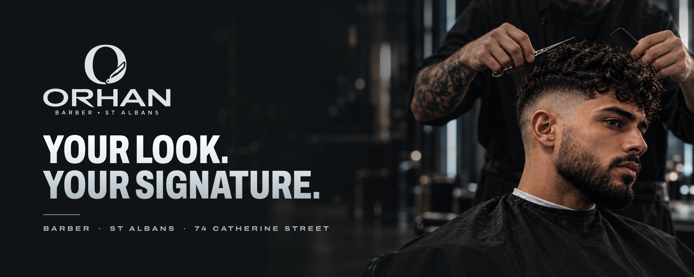
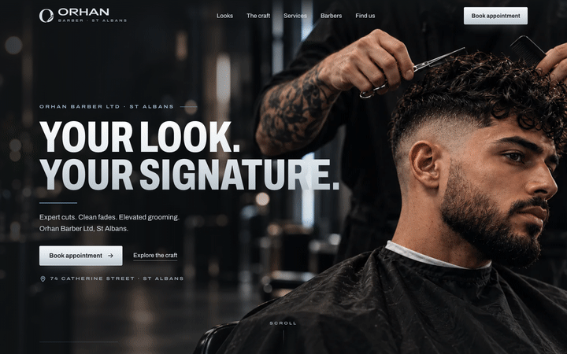
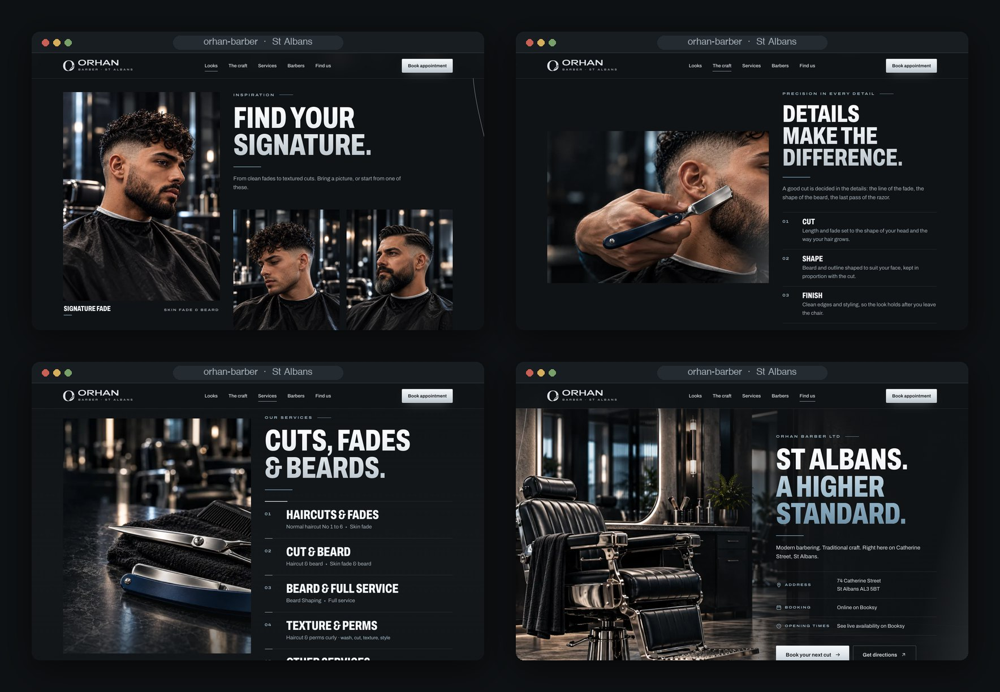
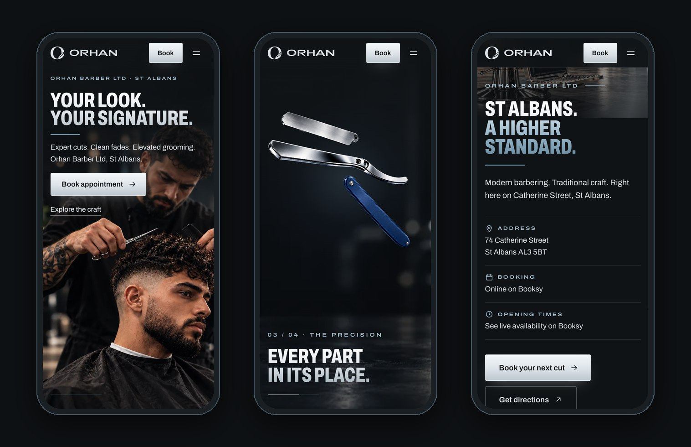
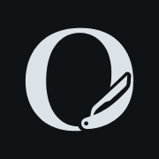

<div align="center">



<h3>A one-page website for a barbershop in St Albans, built around a scroll-driven scene where a silver line traces the fade, turns into the edge of a straight razor, and signs off in the O of the brand.</h3>

<p>
  <a href="https://orhan-barber-st-albans.vercel.app"><strong>🌐 Live site</strong></a>
  &nbsp;·&nbsp;
  <a href="#hero-animation"><strong>🎬 How the hero works</strong></a>
  &nbsp;·&nbsp;
  <a href="#getting-started"><strong>🛠️ Run it locally</strong></a>
</p>

<p>
  <a href="https://orhan-barber-st-albans.vercel.app"></a>
  
  
  
  
  
</p>

</div>

<br />

## 🚀 Overview

**ORHAN Barber** is a barbershop at 74 Catherine Street, St Albans: haircuts, skin fades, beards, texture and perms, booked online on Booksy. The site follows the shop's creative direction *The Signature Line*: graphite, silver and deep blue, men's portraits in natural light, wide letters and room around them. Its opening is a single scroll-driven scene. A client sits in profile while **a silver line traces his fade**; the camera moves in and a match cut turns that hairline into **the lit edge of a straight razor**. The razor **opens into blade, support and handle**, closes, folds shut and swings into **the O of the monogram**, where the finished portrait appears and becomes **the first card of the gallery**.

From there the page calms down: the looks, the craft, the services, the barbers and the address. Every call to action goes to the same place: **Book appointment** on Booksy.

- **Cinematic first impression**: a pinned 2.5D scene made of the kit's own image layers, not a video
- **Measured, not guessed**: the razor parts are registered on the open razor with OpenCV, and the fade line and the steel edge are measured on the photos, so the match cut lands on the edge
- **Built for every visitor**: shorter scene on phones, no pinned section with reduced motion, full keyboard support and visible focus
- **Honest by default**: no prices, no opening hours and no phone number until the shop confirms them; concept images are labelled as such

<br />

<a name="hero-animation"></a>

## 🎬 The hero animation

<div align="center">
  <a href="https://orhan-barber-st-albans.vercel.app"></a>
  <sub>Scroll-scrubbed on the live site · captured at 1440 × 900</sub>
</div>

<br />

The hero stays pinned for almost three extra screen heights and follows the storyboard of the brief:

| Scroll  | What happens                                                                                                                                  |
| :------ | :-------------------------------------------------------------------------------------------------------------------------------------------- |
| 0–17%   | **Presence**: the client in profile, *Your look. Your signature.*, **Book appointment** and **Explore the craft**; a soft light runs along the fade |
| 17–42%  | **The line** (01 / 04): a silver line traces the fade while the camera moves in, then a match cut turns the hairline into the lit edge of the steel |
| 40–54%  | **The edge** (02 / 04): a slow push on the macro, then the camera pulls back from the edge to the whole open razor                            |
| 54–72%  | **The precision** (03 / 04): blade, support and handle separate across the blade and come back together                                       |
| 70–84%  | **The signature**: the razor folds shut and swings onto the razor of the O, while the ring of the O is drawn round from it                    |
| 80–97%  | **The result** (04 / 04): the final portrait appears in an oval inside the O, the oval opens and the portrait shrinks into a framed card: *Find your signature.* |
| after   | **Hand-off**: when the pin releases, the card waits in place while *Find your signature.* rises to meet it, and docks into the first tile     |

**Under the hood**

- 🧩 **One smoothed scroll value drives everything.** The scene is a pure function of the scroll position (`render()` in `src/js/hero.js`), so it runs backwards as cleanly as forwards and resizes without state to rebuild.
- 📐 **Registered with OpenCV.** The kit's blade, support, handle and closed razor were generated separately from the open razor, so they don't line up by themselves. `scripts/register-razor.py` finds the blade by masked template matching over a sweep of scales and angles, fits the parts that are mostly hidden on two measured points (the pivot and the far end), reuses the spacing of the kit's exploded view for the separation, and writes everything to `src/data/razor.json`.
- ✂️ **A match cut, not a dissolve.** The fade line on the photo and the cutting edge on the macro are both short lists of measured points. The photo and the macro are placed so the two lines meet at the same spot and angle on screen, and the silver line morphs point for point from one to the other while the images cross.
- 🎯 **Resolution-aware hand-offs.** The camera pull-back keeps the sharp macro on screen until the razor layer is close to its own pixel size, so the switch from photo to cut-out never shows an upscaled image.
- ⭕ **The O, drawn round.** The logo and monogram are traced to SVG from the kit's PNGs (`scripts/trace-brand.py`). In the scene, a conic mask draws the ring of the O starting from its razor, where the real razor lands pivot on pivot.
- 🖼️ **Invisible hand-off.** The portrait cut-out shares its frame pixel for pixel with the *Signature fade* photo, so when the card docks, the gallery's own image takes over in exactly the same spot. A jump to `#looks` from the menu lands exactly where the card has docked.
- 🧵 **A silver thread.** A thin line, drawn as you scroll, runs through anchor points in every section and ends inside **Book your next cut**.
- 📱 **Three modes, picked before the first paint.** `hero-scroll` on desktop, `hero-compact` on phones (own photo, shorter track, smaller razor), `hero-static` with reduced motion or without JavaScript.

<br />

## 🖥️ Sections

<div align="center">
  
</div>

<br />

| #   | Section                                | Anchor      | Role                                                                                                        |
| :-- | :------------------------------------- | :---------- | :---------------------------------------------------------------------------------------------------------- |
| 01  | **Your look. Your signature.**         | `#top`      | The scene, **Book appointment** and **Explore the craft** from the very first second                        |
| 02  | **Find your signature.**               | `#looks`    | *Signature fade* (where the hero lands), *Texture & perms* and *Haircut & beard*; a tile opens a larger view |
| 03  | **Details make the difference.**       | `#craft`    | The razor on the beard line, one pass of light across the steel, and the three steps: cut, shape, finish   |
| 04  | **Cuts, fades & beards.**              | `#services` | The five service groups of the brief, without prices; a short silver rule marks the group in view           |
| 05  | **Meet the barbers.**                  | `#barbers`  | Orhan Shikho and Jofani, with typographic cards until real portraits arrive                                 |
| 06  | **St Albans. A higher standard.**      | `#visit`    | The chair and the oval mirror, address, booking and directions; the thread ends in the booking button       |

<br />

## 📱 Mobile first, motion optional

<div align="center">
  
</div>

<br />

- On phones the scene uses its own portrait photo and a shorter track, with the razor and the O sized to stay inside the screen
- Once the hero has passed, a **Book appointment** button stays at the bottom of the screen, and steps aside wherever another booking button is already in view
- With `prefers-reduced-motion` there is no pinned section: a static hero, the gallery and the sections, all reachable
- Every touch target is at least 44 px; no horizontal scroll at 375 px
- Without JavaScript the page is complete: static hero, gallery tiles that open the image, every booking link

<br />

## ✨ Highlights

- **🎞️ Scroll storytelling**: the brief's four-panel storyboard (the line, the edge, the precision, the signature), scrubbed with light easing and fully reversible
- **📅 One booking destination**: all nine calls to action open Booksy in a new tab, straight from the HTML, kept in sync with `src/data/booking.json`
- **🖼️ Gallery with a purpose**: a native `<dialog>` with focus management, arrow keys, backdrop close and a booking button in every view
- **🧭 Calm header**: transparent over the photo, solid after the hero, current section highlighted, booking always in reach
- **♿ Accessible by construction**: skip link, real headings, `lang="en-GB"`, decorative scene hidden from assistive tech, hidden-until-animated states that only apply once the code that reveals them is running
- **🖼️ Image pipeline**: the kit's PNGs stay the source of truth; WebP sizes, razor layers, favicon and the social image come from `npm run images`
- **🔎 Ready to share**: Open Graph image with absolute URLs and `HairSalon` structured data with the address from the brief

<br />

## 💻 Tech stack

| <br />Vite 6 | <br />JavaScript | <br />HTML5 | <br />CSS3 | <br />OpenCV | <br />Python | <br />Vercel |
| :---: | :---: | :---: | :---: | :---: | :---: | :---: |

### Why this stack?

- **Vite + plain JavaScript**: a one-page site doesn't need a framework runtime; the page is static HTML with small, focused modules (about 10 KB of JavaScript, gzipped)
- **No animation library**: the hero is a pure function of one scroll value, so a `requestAnimationFrame` loop and CSS transforms are all it needs
- **sharp + OpenCV for the assets**: cutting, registering, measuring and tracing the kit's layers happens once, at build time, not in the browser
- **One self-hosted variable font**: Archivo with its width axis gives condensed titles, normal text and wide, tracked labels that echo the ORHAN wordmark, from a single file and with no third-party font requests
- **Vercel**: every push to `main` deploys automatically; hashed assets are cached for a year (`vercel.json`)

<br />

## 🎨 Design system

| Token       | Value                                                                        | Use                                                   |
| :---------- | :--------------------------------------------------------------------------- | :---------------------------------------------------- |
| Graphite    |  | Page background                                       |
| Panel       |  | Cards and the lightbox                                |
| Deep blue   |  | Light behind the steel, barber cards, hover fills     |
| Steel blue  |  | Rules under titles, list markers (5.9:1 on graphite)  |
| Silver      |  | Text, the line, the main button (14.4:1 on graphite)  |
| Muted       |  | Secondary text (8.3:1 on graphite)                    |

- **Brushed metal**: titles fill with `#FFFFFF → #E3E9ED → #A9B5BD`, top to bottom; the second phrase of a title turns steel blue; the main button is a silver gradient with graphite text
- **Type**: Archivo (variable) at 68% width and weight 800 in uppercase for display, up to 138 px in the hero; 100% width for text, 16–17 px body; 125% width for labels, tracked at 0.3em like *BARBER · ST ALBANS*
- **Grid**: 1,240 px content width, gutters from 16 to 48 px
- **Rhythm**: 88–160 px between sections
- **Motion**: controls react in 220 ms; entrances and the passes of light are short and run once; everything respects `prefers-reduced-motion`

<br />

<a name="getting-started"></a>

## 🛠️ Getting started

```bash
# Clone the repository
git clone https://github.com/Jeanfr1/Orhanwebsite.git
cd Orhanwebsite

# Install dependencies (Node 20.9+)
npm install

# Start the dev server  →  http://localhost:5173
npm run dev

# Production build  →  dist/
npm run build

# Preview the production build
npm run preview

# Regenerate the WebP images, favicon and social image from the PNG sources
npm run images

# Optional, Python 3 (opencv-python, numpy, Pillow): re-measure the razor, re-trace the brand marks
python3 scripts/register-razor.py
python3 scripts/trace-brand.py
```

<br />

## 📁 Project structure

```
Orhanwebsite/
├── index.html                    # Every section: hero → looks → craft → services → barbers → visit → footer
├── src/
│   ├── main.js                   # Entry: font, styles, module init
│   ├── styles/main.css           # Design tokens, hero modes, sections, responsive rules
│   ├── assets/brand/             # logo.svg, monogram.svg, wordmark.svg (traced by trace-brand.py)
│   ├── data/
│   │   ├── razor.json            # Razor, macro, fade line, O and portrait geometry (register-razor.py)
│   │   └── booking.json          # Booksy destination for every booking button (from the kit)
│   └── js/
│       ├── hero.js               # Scroll script: line, match cut, razor, O, portrait, hand-off
│       ├── state.js              # Media queries + small math helpers
│       ├── booking.js            # Keeps every [data-booking] link on the Booksy URL
│       ├── gallery.js            # Lightbox for "Find your signature."
│       ├── services.js           # The short silver rule on the group in view
│       ├── sticky.js             # Phones: booking button after the hero
│       ├── thread.js             # The silver line between sections
│       ├── header.js             # Solid-after-hero header, active link, mobile menu
│       ├── scroll.js             # In-page navigation
│       └── reveal.js             # Section entrances
├── design/source/
│   ├── orhan-roteiro-signature-line.pdf   # The brief (The Signature Line)
│   └── kit/                      # Production images, assembly notes, manifest, Booksy config, references
├── scripts/
│   ├── optimize-images.mjs       # PNG → WebP, razor layers, favicon, OG image
│   ├── register-razor.py         # OpenCV registration of blade, support, handle and closed razor
│   └── trace-brand.py            # Logo and monogram PNG → SVG
├── public/                       # Favicon, touch icon, Open Graph image, gallery images
├── vercel.json                   # One-year cache for hashed assets
└── .vercelignore                 # Keeps design/ and .github/ out of deployments
```

<br />

## 🚀 Deployment

Hosted on **Vercel** and connected to this repository: every push to `main` ships to production.

**Live site:** [orhan-barber-st-albans.vercel.app](https://orhan-barber-st-albans.vercel.app)

| Setting          | Value           |
| :--------------- | :-------------- |
| Framework        | Vite            |
| Build command    | `npm run build` |
| Output directory | `dist`          |

`vercel.json` gives hashed assets a one-year cache; `.vercelignore` keeps the design sources out of the upload.

<br />

<a name="content-checklist"></a>

## 📌 Content checklist

Items waiting on the shop. Each one is marked `TODO(orhan)` in `index.html`.

- [ ] Approve the intro line in the hero and the short text of **Details make the difference.**
- [ ] Confirm the service labels, and the Mon/Thurs restriction on Kids
- [ ] Opening hours and the walk-in policy for **Find us** (until then the site points to live availability on Booksy)
- [ ] Real portraits and approved profiles of Orhan Shikho and Jofani
- [ ] Authorised photos of the shop's own work and space to replace the concept images
- [ ] Confirm the section order: the brief lists The craft and Services right after the hero, but the hero docks the portrait into *Find your signature.*, so the gallery comes first here
- [ ] Confirm the booking link: every button uses the kit's `booking_url` (with its Instagram tracking parameters); the public listing is also in `booking.json`
- [ ] A vector master of the logo for print (the SVGs here are traces of the raster study)
- [ ] Custom domain (then update `canonical`, `og:url`, `og:image` and the structured data `url`)

<br />

## 🙏 Acknowledgments

- **ORHAN Barber Ltd** for the brief, *The Signature Line* direction and the image kit
- **[Archivo](https://fonts.google.com/specimen/Archivo)** by Omnibus-Type (OFL)
- **[sharp](https://sharp.pixelplumbing.com)** and **[OpenCV](https://opencv.org)** for the asset pipeline
- **[Booksy](https://booksy.com)** for online booking
- **[Vite](https://vite.dev)** and **[Vercel](https://vercel.com)**

<br />

---

<div align="center">
  
  <p><strong>Your look. Your signature.</strong></p>
  <p>Built with ❤️ by <a href="https://github.com/Jeanfr1">Jean</a> for ORHAN Barber</p>
  <sub>© 2026 ORHAN BARBER LTD, St Albans. All rights reserved.</sub>
</div>
